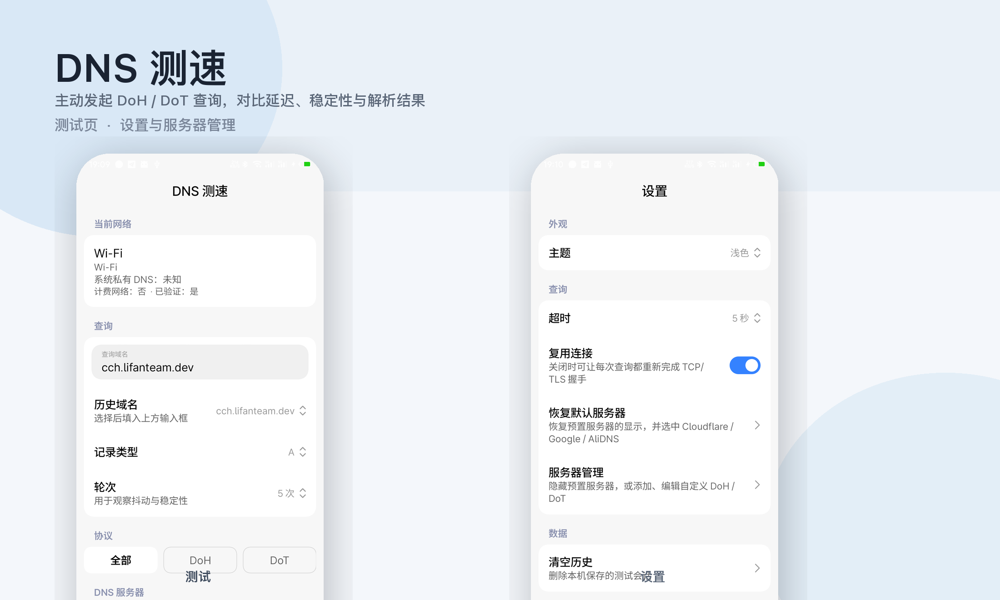

# DNS 测速

<p align="center">
  
</p>

一款 Android DNS 性能测试工具。应用会**主动发起** [DoH（RFC 8484）](https://www.rfc-editor.org/rfc/rfc8484) 与 [DoT（RFC 7858）](https://www.rfc-editor.org/rfc/rfc7858) 查询，记录 TCP 连接、TLS 握手、首字节与整段耗时，并展示解析结果，方便在 Wi-Fi、蜂窝等不同网络下对比延迟、稳定性与应答差异。

基于 **Kotlin**、**Jetpack Compose** 与 **Miuix** 构建，界面遵循 HyperOS / MIUI 风格。

## 功能

### 测速与对比

- 多 DNS 服务器**并行**查询，支持 1 / 3 / 5 轮次观察抖动
- 支持记录类型：A、AAAA、CNAME、MX、TXT、NS、PTR、SOA、HTTPS 等
- 按协议筛选：全部 / DoH / DoT
- 结果聚合统计：最快、平均、最慢、抖动、成功率
- 多维度排序与条形图排名
- 对比不同服务器的解析结果是否一致

### 可观测性

- 完整事件时间线：引导解析、TCP、TLS、HTTP / 长度前缀读写、报文解析
- 单次查询详情：RCODE、Answer 记录、TLS 套件、远端地址、HTTP 状态等
- 展示当前网络类型、传输方式、计费状态、连通性验证、系统私有 DNS 模式

### 服务器与配置

- 预置 7 家公共 DNS 的 DoH / DoT 端点（见下表）
- 使用**引导 IP（Bootstrap）**直连，避免测速过程依赖系统 DNS
- 支持隐藏预置服务器、添加 / 编辑自定义 DoH / DoT
- 可配置查询超时、是否复用连接、主题（跟随系统 / 浅色 / 深色 / 动态色）

### 历史记录

- 测试会话保存在本机（DataStore），可回看每次测试的完整结果
- 常用域名自动记录，便于重复测试

## 预置 DNS 服务器

| 服务商 | DoH | DoT | 引导 IP |
|--------|-----|-----|---------|
| Cloudflare | `cloudflare-dns.com` | `1.1.1.1:853` | 1.1.1.1, 1.0.0.1 |
| Google | `dns.google` | `8.8.8.8:853` | 8.8.8.8, 8.8.4.4 |
| Quad9 | `dns.quad9.net` | `9.9.9.9:853` | 9.9.9.9, 149.112.112.112 |
| AdGuard | `dns.adguard-dns.com` | `94.140.14.14:853` | 94.140.14.14, 94.140.15.15 |
| AliDNS | `dns.alidns.com` | `223.5.5.5:853` | 223.5.5.5, 223.6.6.6 |
| DNSPod | `doh.pub` | `1.12.12.12:853` | 1.12.12.12, 120.53.53.53 |
| OpenDNS | `doh.opendns.com` | `208.67.222.222:853` | 208.67.222.222, 208.67.220.220 |

默认选中：Cloudflare、Google、AliDNS 的 DoH / DoT。

## 使用说明

1. 在**测试**页确认当前网络信息，输入要查询的域名并选择记录类型
2. 勾选要对比的 DNS 服务器，可按需切换 DoH / DoT 筛选
3. 点击**开始测试**，等待并行查询完成
4. 在结果列表中查看各服务器耗时与解析摘要；点击条目进入**查询详情**查看完整时间线与报文
5. 在**历史**页回看以往测试会话；在**设置**页管理服务器、超时与主题

### 自定义服务器

在 **设置 → 服务器管理** 中添加自定义端点：

| 协议 | 地址格式示例 |
|------|-------------|
| DoH | `https://dns.example.com/dns-query` 或 `dns.example.com` |
| DoT | `dns.example.com` 或 `dns.example.com:853` |

可选填写：

- **引导 IP**：逗号、分号或空格分隔，例如 `1.2.3.4, 2001:db8::1`
- **SNI**：TLS 握手使用的 Server Name；留空时默认与主机名相同

## 项目结构

```
app/src/main/java/com/dnsspeedtest/app/
├── dns/                 # 查询引擎、编解码、预置目录、统计
│   ├── DnsQueryEngine.kt
│   ├── DohClient.kt
│   ├── DotClient.kt
│   ├── DnsCodec.kt
│   ├── DnsServerCatalog.kt
│   └── QueryStats.kt
├── network/             # 网络状态采集
├── data/                # DataStore 设置与历史
└── ui/                  # Compose + Miuix 界面
```

## 环境要求

| 项 | 版本 |
|----|------|
| JDK | 17 |
| minSdk | 24（Android 7.0） |
| targetSdk | 36 |
| compileSdk | 37 |

建议使用项目自带的 Gradle Wrapper，无需单独安装 Gradle。

## 构建与测试

```bash
# 代码风格检查 / 自动格式化
./gradlew ktlintCheck
./gradlew ktlintFormat

# 单元测试
./gradlew testDebugUnitTest

# 调试 APK
./gradlew assembleDebug
```

Windows PowerShell 将 `./gradlew` 替换为 `.\gradlew.bat` 即可。

产物路径：`app/build/outputs/apk/debug/app-debug.apk`

## 安装与调试

```bash
# 查看设备
adb devices

# 编译并安装调试包
.\gradlew.bat installDebug

# 启动应用
adb shell am start -n com.dnsspeedtest.app/.MainActivity

# 查看相关日志
adb logcat -s DnsSpeedtest DnsQueryEngine DohClient DotClient
```

也可直接安装已有 APK：

```bash
adb install -r app\build\outputs\apk\debug\app-debug.apk
```

## 技术栈

| 类别 | 依赖 |
|------|------|
| 语言 / 构建 | Kotlin 2.3.20、AGP 9.0.1 |
| UI | Jetpack Compose BOM 2026.03.01、Miuix 0.9.3 |
| 网络 | OkHttp 5（DoH）、`SSLSocket`（DoT） |
| 存储 | DataStore + kotlinx.serialization |
| 质量 | ktlint Gradle 插件 |

## 隐私说明

应用仅发起你配置的 DNS 查询，测试数据与历史记录均保存在本机，不会上传至任何服务器。

## 许可证

尚未指定开源许可证。如需二次分发或商用，请先与作者确认。
